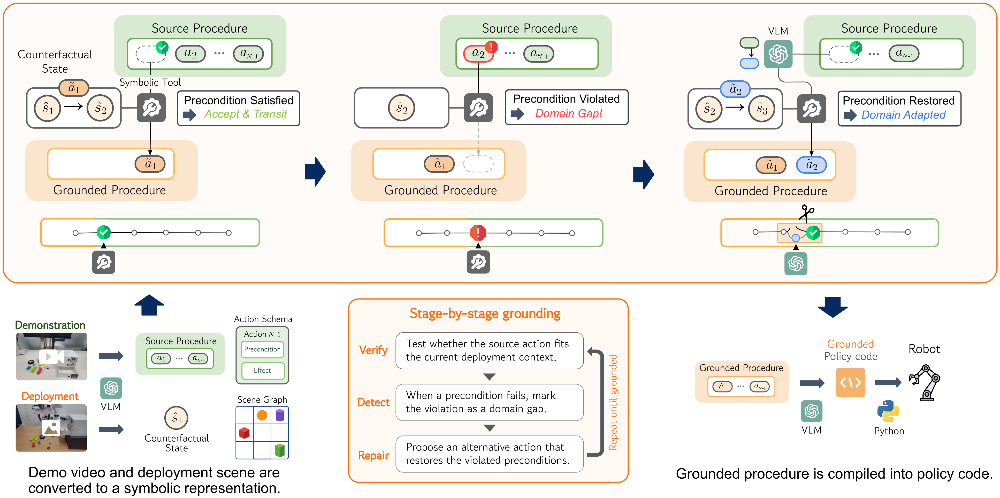

<h1 align="center">NeSyCR</h1>

<p align="center">
  
</p>

<p align="center">
  This is an official implementation for the CVPR 2026 paper:<br>
  <b>Cross-Domain Demo-to-Code via Neurosymbolic Counterfactual Reasoning</b>
</p>

<p align="center">
  Jooyoung Kim &middot; Wonje Choi &middot; Younguk Song &middot; Honguk Woo
</p>

Given a demonstration in a *source* environment, the agent induces a symbolic
task specification and, through neurosymbolic counterfactual reasoning, adapts
it to generate executable code for a structurally different *target* environment
(different obstacles, gripper, affordances, etc.). The benchmark is built on top
of the [Genesis](https://github.com/Genesis-Embodied-AI/Genesis) physics
simulator with a Franka Emika Panda arm.

## Installation

```bash
# Python 3.11 
conda create -n nesycr python=3.11 -y
conda activate nesycr

pip install -r requirements.txt
pip install -e .
```

The LLM backend uses the OpenAI API. Set your API key in the environment:

```bash
export OPENAI_API_KEY=<your-key>
```

## Usage

The pipeline is driven by the benchmark configs in `configs/` (named
`{domain}_{density}.json`, e.g. `comb_medium`). 

#### 1. Collect source demonstrations

Runs the source-environment demos for the config and saves them to
`data/demo/{config}/`.

```bash
python scripts/eval/collect_from_config.py --config comb_medium
```

#### 2. Run inference (generate target policy code)

For each episode, the model induces a spec from the source demo and generates
executable code for the target environment.

```bash
python scripts/eval/inference_from_config.py \
    --config comb_medium \
    --run_id comb_medium \
    --model nesycr \
    --llm gpt-5 \
```

#### 3. Evaluate the generated code

Evaluates the generated policy code in the target environment to measure success.

```bash
python scripts/eval/evaluate_from_log.py \
    --config comb_medium \
    --log_dir logs/comb_medium/nesycr
```

## Tasks

| Task              | Description                          |
| ----------------- | ------------------------------------ |
| `pick_place`      | Pick an object and place it          |
| `sweep`           | Sweep objects across the table       |
| `put_in_prismatic`| Put an object into a sliding drawer  |
| `put_in_hinge`    | Put an object into a hinged box      |
| `composite`       | Multi-step sequences of the above    |

Benchmark configurations in `configs/` are grouped by axis of variation
(`affo`, `comb`, `grip`, `obst`, `vacu`) and difficulty (`low`/`medium`/`high`).

## Models

**Ours:** `nesycr`

**Baselines:** `demo2code_adapt`, `gpt4vrobot`, `critic`,
`statler`, `llmdm`, `morevqa`

## Repository structure

```
src/
  env/         Genesis environment, tasks, state observer
  model/
    ours/      NeSyCR (simulator + refiner components)
    baselines/ Baseline methods
  common/      Shared utilities, LLM calls, logging, evaluation
scripts/
  eval/        Evaluation pipeline (collect / inference / evaluate)
  aggregate.py Aggregate results into metrics
configs/       Benchmark episode configurations
data/prompts/  LLM prompt templates per method
assets/        3D meshes and robot models
```

## Assets & third-party licenses

`assets/` includes third-party robot models (Franka Emika Panda, UR5, Robotiq)
under their respective upstream licenses. See `assets/franka_emika_panda/README.md`.

## Issues

If you run into an error, please [open an issue](../../issues).

## License

Released under the [MIT License](LICENSE). Third-party assets in `assets/`
remain under their respective upstream licenses.

## Citation

```bibtex
@inproceedings{kim2026cross,
  title={Cross-Domain Demo-to-Code via Neurosymbolic Counterfactual Reasoning},
  author={Kim, Jooyoung and Choi, Wonje and Song, Younguk and Woo, Honguk},
  booktitle={Proceedings of the IEEE/CVF Conference on Computer Vision and Pattern Recognition},
  pages={18848--18858},
  year={2026}
}
```
